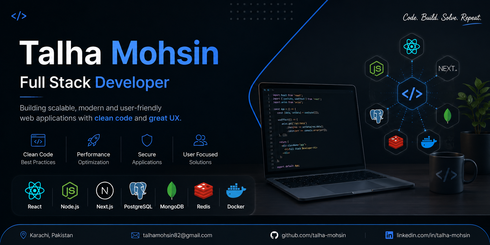

<p align="center">
  
</p>

<h1 align="center">Hi 👋, I'm Talha Mohsin</h1>

<h3 align="center">
Full Stack Software Engineer • React • Next.js • Node.js • TypeScript
</h3>

<p align="center">
Building scalable, high-performance web applications with modern technologies.
</p>

---

# 👨‍💻 About Me

I'm a passionate **Full Stack Software Engineer** focused on building scalable, secure, and user-centric web applications.

I enjoy transforming complex problems into clean engineering solutions using modern frontend and backend technologies.

My expertise includes developing responsive user interfaces, designing RESTful APIs, implementing authentication systems, optimizing databases, and building production-ready full stack applications.

Currently I'm expanding my expertise in:

- AI Agents
- System Design
- Cloud Computing
- Microservices
- Scalable Backend Architecture

---

# 🚀 Professional Summary

- 💼 Full Stack Developer
- 🎓 Software Engineering Student
- 💻 JavaScript & TypeScript Enthusiast
- ⚡ Backend API Developer
- 🧠 Problem Solver
- 🚀 Continuous Learner

---

# 🛠 Tech Stack

## Frontend

- HTML5
- CSS3
- JavaScript (ES6+)
- TypeScript
- React.js
- Next.js
- Redux Toolkit
- Tailwind CSS
- Material UI
- Ant Design
- Shadcn UI

---

## Backend

- Node.js
- Express.js
- REST APIs
- JWT Authentication
- RBAC
- Socket.io
- Firebase
- Supabase

---

## Databases

- MongoDB
- PostgreSQL
- MySQL
- Redis

---

## DevOps & Cloud

- Docker
- Git
- GitHub
- Vercel
- Render
- AWS (Learning)

---

## Developer Tools

- VS Code
- Postman
- Jest
- GitHub Actions
- AI Tools

---

# 💼 Experience

### Full Stack Developer
Ace On Technology

- Building scalable React.js applications
- Developing REST APIs using Node.js
- Database optimization
- Component-based architecture
- Performance improvements

---

### Full Stack Bootcamp
Saylani Mass IT Training

- MERN Stack Development
- Authentication Systems
- Team Collaboration
- Real-world Projects

---

### Web Developer Intern

- Responsive Web Applications
- API Integrations
- UI Development
- Cross-browser Compatibility

---

# 📌 Featured Projects

| Project | Stack | Status |
|---------|-------|--------|
| Documentation Hub | MERN | ✅ Completed |
| Kiraya Nama (SaaS) | PERN | 🚧 In Progress |
| ShopHub | React + Redux | ✅ Completed |
| GeoTrace | React + Maps API | ✅ Completed |
| AI Projects | AI + Node.js | 🚀 Growing |

---

# 🎯 Current Focus

Currently learning and building production-grade applications around:

- AI Agents
- Docker
- Redis
- PostgreSQL
- System Design
- Scalable Backend Architecture
- Cloud Deployment

---

# 📈 GitHub Goals

- Build production-ready software
- Contribute to Open Source
- Learn scalable architecture
- Write clean and maintainable code
- Share engineering knowledge

---

# 📄 Resume

📥 Resume available inside:

```

resume/

```

---

# 📬 Contact

📍 Karachi, Pakistan

📧 talhamohsin82@gmail.com

💼 LinkedIn:
https://linkedin.com/in/talha-mohsin

🐙 GitHub:
https://github.com/talha-mohsin

---

<h3 align="center">

Thanks for visiting my profile ❤️

Let's build something amazing together 🚀

</h3>