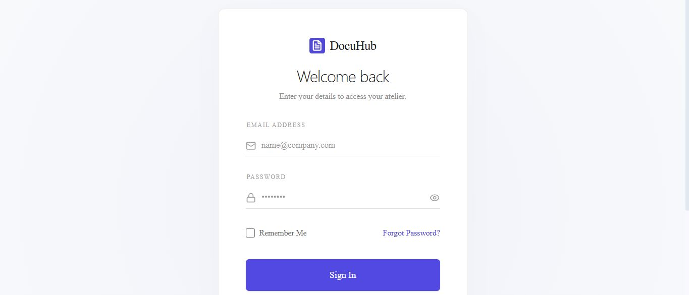
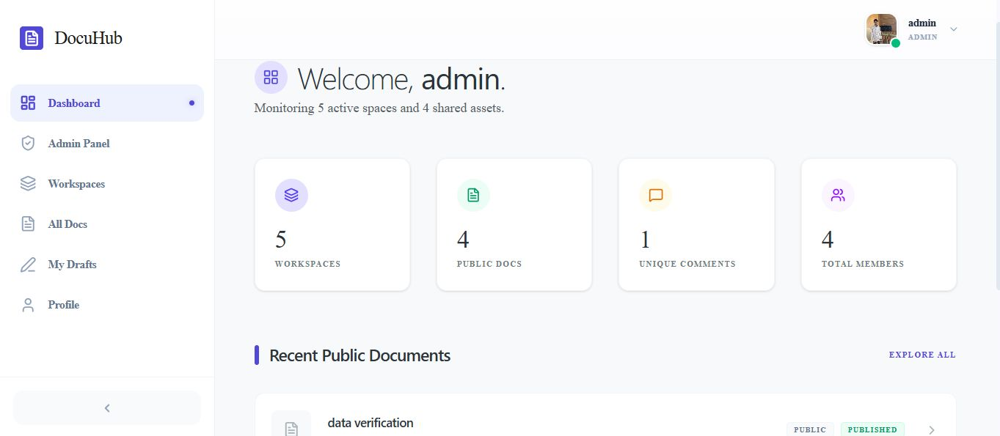

# Documentation Hub

## Overview

Role-based documentation platform built with React and Node.js.

## Features

- JWT Authentication
- RBAC
- CRUD
- Rich Text Editor
- Search
- Comments
- Tags

## Tech Stack

React

Node

MongoDB

Express

JWT

## Challenges

Explain problems you solved.

## What I Learned

I learned how to work in the team environment I explore advance github I solve a lot of problems.

## Screenshots

Add screenshots.

